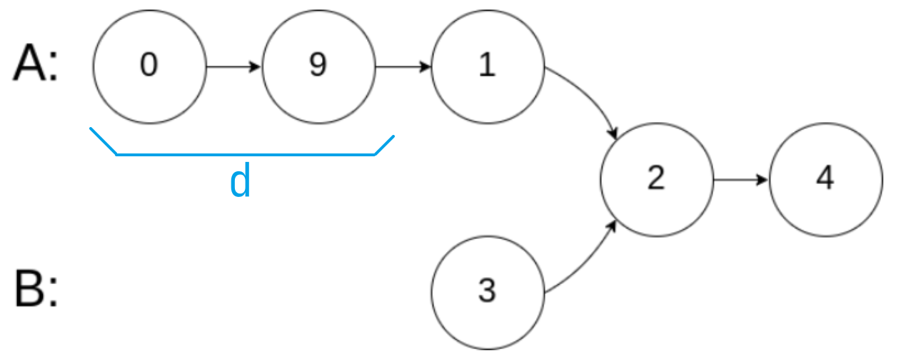

> 顺序： https://programmercarl.com/
# 数组

## [704. 二分查找](https://leetcode-cn.com/problems/binary-search/)

[题解](https://programmercarl.com/0704.二分查找.html#_704-二分查找)

二分法思路简单，但是要注意，二分法要求数组元素**有序且唯一**。有序是二分法的前提，如果元素不唯一，也能找得到，但是返回的下标也**可能不唯一**

然后是区间的开闭问题，也就是搜索范围是否包括边界，区间的选取问题会导致 `left` 和 `right` 的比较是否要 `=`，`middle` 的改变是否要 `+/- 1`，还是直接 `=`。区间选取没有优劣，但是要保证其统一，本质上还是边界处理问题，这里我选择全闭 `[ ]`

### 相关题目

#### [35. 搜索插入位置](https://leetcode-cn.com/problems/search-insert-position/)

[题解](https://programmercarl.com/0035.搜索插入位置.html)

这题和 704 一样，二分查找，区别在于没找到的时候要返回**按序插入的位置**

所以如果没找到，这个位置这么确定呢？

大致分为三种情况

1. 头部插入（0）

   这种情况位置 = middle（也就是 **left**，因为这个值太小，left没变过，一直是0）

2. 中间插入（numSize)

   这种情况，如果 target < nums[middle]，那位置就是 middle（也就是 **left**，因为要往左边找）

   ​					如果 target > nums[middle]，那位置就是 middle+1（也就是 **left**，因为要往右边找）

3. 尾部插入（middle?）

   这种情况位置 = middle+1（也就是**left**，因为太大，所以要往右)

因此，最终结论是：**全都返回 left 就行了**

这个结果的奇妙之处在于，最后一次循环，**middle=left=right**，因为左边找不到比 middle 小的数了，所以如果目标值比当前的值小，则目标值就要插到当前的位置，即 left，而 right 根据逻辑会等于 middle-1，不影响 left 的值；而如果目标值比当前的值大，则目标值要插到当前位置的后面，即 middle+1，而 left 根据逻辑会等于 middle+1，而这个 left 的新值正好就是我们需要的。（💡注意，同样的，也可以返回 **right+1**）

❗把握住一点：如果没有找到目标元素，则右指针会指向最大小于 target 的值，左指针指向最小大于 target 的值。（注意，这指的是 left 和 right 还没有改变的时候）**这个规律很明确，但是太拗口，实际上，如果逻辑清晰的情况下，这个规律并不好用，因为这句话本身太过复杂**

其实还有一个简单的办法：直接在 left==right 但是当前值又不是目标值的时候，直接判断 target 和当前值的大小，target 大于当前值，就直接返回 middle+1，反之返回 middle-1，当然这样会增加时间复杂度，不过本着写的就是垃圾代码的厚脸皮心态，这种做法也不是不行（没有暴力破解就不错了）


#### [34. 在排序数组中查找元素的第一个和最后一个位置](https://leetcode-cn.com/problems/find-first-and-last-position-of-element-in-sorted-array/)

[题解](https://programmercarl.com/0034.在排序数组中查找元素的第一个和最后一个位置.html)

首先 O(log n) 的时间复杂度指明了需要使用二分查找

最朴素的想法，在二分法的基础上，找到 `targetIndex` 后，**一格格地左右探**，就能探明起始位置。但是这一块的时间复杂度是这里的复杂度是 O(m)（m是目标值的数量） ，显然不满足 O(log n) （总时间复杂度是O(log n + m) ）。时间复杂度不符合要求的原因也很简单，在查找到目标元素后，**二分查找退化为了线性查找**，因而时间复杂度不符合要求

要满足 O(log n) 的时间复杂度，需要在 `[left, targetIndex-1]` 和 `[targetIndex+1, right]` 里**继续二分查找**，在左半边里找到第一个 target，在右半边找到最后一个 target

至于怎么找第一个和最后一个，实际上要做的是**改写普通的二分查找**：对于**左半边**，在找到 target 时，看前一个元素是不是也是 target，如果是，就**继续二分查找的循环**，如果不是，就返回它的下标；对于**右半边**，也类似，在找到 target 时，看后一个元素是不是也是 target，如果是，就**继续二分查找的循环**，如果不是，就返回它的下标（注意判断边界溢出问题）

❗题目是要求 O(log n) 的时间复杂度，所以直接怼两次二分查找，2*(log n) = O(log n)，是符合要求的

> ❗❗69 和 367 的边界判定有问题，AC 有水分

#### [69. x 的平方根](https://leetcode-cn.com/problems/sqrtx/)

数学题，太难了😭

数学知识：0 和 1 的平方根是它本身；x 的平方根总小于 x/2（x>4)

二分查找就是不断逼近平方根

#### [367. 有效的完全平方数](https://leetcode-cn.com/problems/valid-perfect-square/)

和 69 题一样，二分法解决问题

如果条件判断的时候发现 `middle==num/middle` 且 `num % middle == 0`，就返回 `true`，否则返回 `false` 其他情况下走出循环就返回 `false`

## [27. 移除元素](https://leetcode-cn.com/problems/remove-element/)

题目说明居然很贴心地说明是数组引用，这是我没想到的😶

可以选择每一次发现一个目标元素就把后面的所有元素往前移进行覆盖，就是有点麻烦

tags 给了提示，`two-pointers`，那用双指针

维护两个指针，一个 `i` 用来遍历「原数组」，一个 `j` 用来遍历「返回的数组」

遍历原数组，如果 `nums[i]!=val`，就 `nums[j++]=nums[i++]` 否则就直接 `i++`

因为数组本来就需要遍历，所以 `i` 直接用作循环变量，不需要另外设指针

代码实在太短，忍不住贴上来嗨一下

```c
int removeElement(int *nums, int numsSize, int val)
{
    int j = 0; // 新数组目前遍历到的位置，同时也是新数组的长度

    // 遍历整个数组，如果不等于 val，就采用
    for (int i = 0; i != numsSize; i++)
    {
        if (nums[i] != val)
            nums[j++] = nums[i];
    }
    return j;
}
```

### 相关题目

#### [26. 删除有序数组中的重复项](https://leetcode-cn.com/problems/remove-duplicates-from-sorted-array/)

和 27 题类似，双指针，只是这次要判断的不是目标元素，而是「重复」

因为它是有序的，所以只需要判断「新数组」和「原数组」的当前位（指针指向的值）是不是相等，不相等的不采用即可

要做一个长度判断，要求长度大于等于2，然后先把第一个元素纳入新数组，在这个基础上做循环判断

> 26 和 27 都是双指针，难度也不大，但是在**边界选取**上存在差异，需要注意区分，试了 3 次才 AC

```c
int removeDuplicates(int *nums, int numsSize)
{
    // 长度为 0 和 1 就不判断了，循环的要求是 numsSize >= 2
    if (numsSize < 2)
        return numsSize;
        
    int j = 0; // 新数组目前遍历到的位置，同时也是「新数组的长度 - 1」

    // 遍历整个数组，如果「旧数组」和「新数组」当前位不一样，就采用
    for (int i = 1; i != numsSize; i++)
    {
        if (nums[i] != nums[j])
            nums[++j] = nums[i];
    }
    return j + 1;
}
```


#### [283. 移动零](https://leetcode-cn.com/problems/move-zeroes/)

这题和 27 题比较类似，也是删除目标元素，只是再多做一步，在末尾后面补 0，判断条件比 26 题简单

0 的数量 n = 原数组长度 - 新数组长度，从 nums[numsSize-1] 开始往前写 n 个 0 就行了

```c
void moveZeroes(int *nums, int numsSize)
{
    int j = 0; // 新数组目前遍历到的位置，同时也是新数组的长度

    // 遍历整个数组，如果不等于 0，就采用
    for (int i = 0; i != numsSize; i++)
    {
        if (nums[i] != 0)
            nums[j++] = nums[i];
    }

    // 从 nums[numsSize-1] 开始往前写 0
    for (int i = 0; i != numsSize - j; i++)
    {
        nums[numsSize - 1 - i] = 0;
    }
}
```

> AC 完了看到这个进阶提示：「**进阶：**你能尽量减少完成的操作次数吗？」
>
> 💡确实还能，可以选择**三指针**，直接在发现 0 的时候从数组末尾开始往前写 0
>
> ```c
> void moveZeroes(int *nums, int numsSize)
> {
>     int j = 0;        // 新数组目前遍历到的位置，同时也是新数组的长度
>     int k = numsSize; // 用来写 0 的指针
> 
>     // 遍历整个数组，如果不等于 0，就采用
>     for (int i = 0; i != numsSize; i++)
>     {
>         if (nums[i] != 0)
>             nums[j++] = nums[i];
>         else
>         {
>             nums[--k] = 0;
>         }
>     }
> }
> ```
>
> 写完觉得自己真是个小天才😀，submit ! ，**Wrong Answer**。看着错误提示我才反应过来，我在没遍历完之前就把本来要遍历的数组尾部的数据给写 0 了
>
> 想了很久，确定没有办法实现，溜了
>
> 官方题解的双指针是一个指向 0，一个指向非 0，感觉有点复杂
>
> **如果不要求相对有序**的话，是可以选择把尾部的元素写到 0 的位置的，这种方案倒是可以实现类似上面说的那种思路

#### [844. 比较含退格的字符串](https://leetcode-cn.com/problems/backspace-string-compare/)

如果不考虑 `O(n)` 的时间复杂度和 `O(1)` 的空间复杂度，那就直接就写到两个新的数组里，碰到一个 `#` 就指针回退一位

要求空间复杂度 `O(1)` 只能原地比较了，题目没有说不能修改原数组，那就直接上手改它就完事儿了（时间复杂度 `O(m+n)` = `O(n)`）

```c
/**
 * @brief 文本处理
 *
 * 处理字符串中的退格字符 '#'，处理成全字符形式，末尾补上 '\0'
 *
 * @param s 要处理的字符串
 */
void TextProcess(char *s)
{
    int i = 0; // 遍历指针
    int j = 0; // 有效字符指针
    while (s[i])
    {
        // 如果不是 '#'，就采用该字符
        if (s[i] != '#')
        {
            s[j++] = s[i];
        }
        // 如果是 '#'，而且 j 不为 0，就让有效指针回退
        // 不知道会不会有一大堆的 '#'，还是判断一下 0 比较保险
        else if (j != 0)
        {
            j--;
        }
        i++;
    }
    // 处理完了之后在末尾补 0
    s[j] = '\0';
}

bool backspaceCompare(char *s, char *t)
{
    // 直接改动原数组，然后比较
    TextProcess(s);
    TextProcess(t);
    return !strcmp(s, t);
}
```

**其他思路 0**

两个指针，从后往前遍历；两个变量，记录这次需要退格的次数

如果当前字符不是 `#`，退格次数 -1

如果是 `#`，则退格次数 +1

直到退格次数为 0，且当前字符不是 `#` 时，退出循环，得到这次要比较的字符

```c
/**
 * @brief 找到下一个用来比较的字符的下标
 *
 * @param s 要寻找的字符串
 * @param index 开始的下标（从后往前）
 * @return int 找到的下标（没找到就返回 -1，没找到的意思是前面是空的）
 */
int IndexOfNextChar(char *s, int index)
{
    int skipNum = 0; // 退格次数

    while (index >= 0)
    {
        if (s[index] == '#') // 是退格符，记录
        {
            skipNum++;
        }
        else // 如果不是退格符，看一下要不要退格
        {
            if (skipNum == 0)
            {
                // 不需要退格，那找到了
                return index;
            }
            else
            {
                // 需要退格，那就退格
                skipNum--;
            }
        }

        // 继续往前找
        index--;
    }
    // 没找到就返回 -1
    return -1;
}

bool backspaceCompare(char *s, char *t)
{
    // 从后往前遍历

    // 用来比较的指针
    int sIndex = strlen(s) - 1;
    int tIndex = strlen(t) - 1;
    while (true)
    {
        // 找下一个要比较的字符的下标
        sIndex = IndexOfNextChar(s, sIndex);
        tIndex = IndexOfNextChar(t, tIndex);

        if (sIndex == -1 || tIndex == -1) // 如果其中有至少一个前面的部分是空的
        {
            // 如果都是空的，两个字符串相等，返回 ture
            if (sIndex == -1 && tIndex == -1)
                return true;
            else // 否则二者不相等，返回 false
                return false;
        }
        else // 都不为空，开始判断
        {
            // 这两个字符二者不相等，返回 false
            if (s[sIndex] != t[tIndex])
            {
                return false;
            }
            else // 相等则继续找下一个字符
            {
                // 这一位没问题就往前再找一位
                // 不用担心越界，IndexOfNextChar 发现越界会返回 -1
                sIndex--;
                tIndex--;
            }
        }
    }
}
```

因为是从后往前，所以没有回退的问题（时间复杂度 `O(m+n)` = `O(n)`）

**其他思路1**

直接用栈，碰到 `#` 就退栈，最后判断两个栈（不满足空间复杂度要求）


#### [977. 有序数组的平方](https://leetcode-cn.com/problems/squares-of-a-sorted-array/)

数组平方后虽然不再是非递减的，但是是「两边大，中间小」的，所以就可以双指针，指向首尾，向中间递进，取其中大的，写入新数组（从后往前写）

写起来很顺，没啥坑

> 本来应该一遍过的，结果编译出错了三次，因为 `left` 写成 `lfet` 了，vscode 楞是没有一个提示，就挺离谱的，啊？是我关的波浪线啊，那没事了😵

## [209. 长度最小的子数组](https://leetcode.cn/problems/minimum-size-subarray-sum/)

滑动窗口解法（双指针），维护左右两个指针，使指针域内的数字和 `sum >= target`

可以简单地把窗口滑动的过程分成两部分（有顺序关系）：

1. 右边界右移，使子数组的和符合要求
2. 左边界右移，使子数组的和不再符合要求

然后具体分析在哪些边界的条件下需要判定最小长度 `min_len` 即可

由于每个数都进出窗口一次，故时间复杂度为`O(2n)`=`O(n)`

> 前缀和+二分的没看懂，先跳过

### 相关题目

#### [904. 水果成篮](https://leetcode.cn/problems/fruit-into-baskets/)

需要明确一点，最终找到的那个区间，里面只会有最多两种水果，所以维持一个至多两种水果类型的区间即可

与209类似，同样可以把窗口滑动的过程分成两个部分（有顺序关系）：

1. 右边界右移，使区间内只有两种水果（`right` 尽量大）
2. 左边界右移，使区间内剩下一种水果（类型是 `fruits[right]`）

#### [76. 最小覆盖子串](https://leetcode.cn/problems/minimum-window-substring/)

维持一个最小子串区间，使区间内至少包含指定数量的目标字符

需要初始化一个键值对/map，记录目标字符及数量

```c
/* 计算 t 中每个字符的数量 */
int value[128] = {0}; // 对应 ASCII 码表，A=65 z=122
for (int i = 0; t[i] != '\0'; i++)
{
    value[t[i]]++;
}
```

依然是把窗口滑动的过程分成两部分（有顺序关系）：

1. 右边界右移，使区间内包含指定数量的目标字符，然后左边界右移，压缩区间长度至最小
2. 左边界右移一位，使空间不再符合要求

## [59. 螺旋矩阵 II](https://leetcode.cn/problems/spiral-matrix-ii/)

模拟过程。分析怎么确定边界显然很痛苦，不如用一个数组来记录某个位置是否被访问过，以此为依据循环 `right → down → left → up` 即可

### 相关题目

#### [54. 螺旋矩阵](https://leetcode.cn/problems/spiral-matrix/)

和 59 思路类似，59 是写，54 是读

> 实际程序编写中还是出现了一些问题，因为 59 是 n×n，而 54 是 m×n，导致从 59 copy 的代码出错，一开始还没发现，盯了半天才排查出错误，copy 的时候还是需要小心小心再小心😵

# 链表

## [203. 移除链表元素](https://leetcode.cn/problems/remove-linked-list-elements/)

注意小心空链表判断

## [707. 设计链表](https://leetcode.cn/problems/design-linked-list/)

体力活

首先，模板给出的结构体是不能直接用的：

```c
typedef struct {

} MyLinkedList;
```

在这个结构里，`next` 的类型不能是 `MyLinkedList*`，因为别名叫 `MyLinkedList` 的结构体压根没有定义完毕，编译器不知道名字叫 `MyLinkedList` 的类型是什么，实际的定义方式如下：

```c
typedef struct MyLinkedList_t{
	int val;
	struct MyLinkedList_t *next;
} MyLinkedList;
```

只实现了带头结点的单链表的版本，双链表懒得写

## [206. 反转链表](https://leetcode.cn/problems/reverse-linked-list/)

用的双指针。看了下递归，我发现我还是是弱智，还是老老实实迭代吧

## [24. 两两交换链表中的节点](https://leetcode.cn/problems/swap-nodes-in-pairs/)

和 206 思路类似，双指针解决。

和 206 的不同之处在于，206 是围绕箭头（指向）为中心，不断前移的「窗口」，窗口大小为 2；而 24 看起来类似，实际上窗口的大小宏观上应该看作 4，因为 `1234→2143`，第一个元素交换后，它的`next` 不再是 `3`，而是 `4`，因此引发的边界判断也需要结合具体代码实现进行处理

> [题解](https://programmercarl.com/0024.%E4%B8%A4%E4%B8%A4%E4%BA%A4%E6%8D%A2%E9%93%BE%E8%A1%A8%E4%B8%AD%E7%9A%84%E8%8A%82%E7%82%B9.html)里用虚拟头结点的方式好像可以把窗口规模控制在 2，还没有仔细看

## [19. 删除链表的倒数第 N 个结点](https://leetcode.cn/problems/remove-nth-node-from-end-of-list/)

双指针（快慢指针），用一个计数器 `i` 记录当前访问的是第几个节点，当 `i==n` 的时候，让一个指针从头节点开始往后遍历（协同主遍历过程）。

分析一下 fast 和 slow 的步进（{1, 2, 3, 4, 5}, n=2, 目标删除 4）：

| 迭代轮次 | fast 指向 | slow 指向 |
| -------- | --------- | --------- |
| 0        | 1         | 1         |
| 1        | 2         | 1         |
| 2        | 3         | 1         |
| 3        | 4         | 1         |
| 4        | 5         | 2         |
| 5        | NULL      | 3         |

显然，当 fast 遍历完毕，`slow->next` 指向的节点即倒数第 n 个节点

从索引上讲，就是维持 fast - slow = n+1

> 没有用**虚拟头结点**，一些情况的判断很 drama，最后因为边界的问题脑子都乱了，如果一开始用上虚拟头结点应该会好很多，索性最终结果是 AC 了，就不改了
>
> 使用虚拟头结点可以显著减少边界情况的处理，为了少死点脑细胞，能用则用

[面试题 02.07. 链表相交](https://leetcode.cn/problems/intersection-of-two-linked-lists-lcci/)

**思路 1**：

创建两个空链表（val 的类型为 node），分别遍历给出的两个链表的所有节点，头插法插入到空链表中。然后用双指针法判断从哪个节点开始两个节点的 val 不同。

**思路 2**：

先看数学结论：若链表 1 长为 a，链表 2 长为 b，且二者相交，相交部分长度为 c。即 a=a'+c，b=b'+c。假设 a>b，则二者差值 d=a-b=a'-b'。

如果链表 1 和链表 2 相交，则 d 为如下区域：



因此，最重要的工作是：**让两个链表右对齐**。然后就可以同步比较两个节点的指针了

再结合实际过程：同步遍历链表 1 和链表 2，显然，当链表 2 遍历完毕后，**链表 1 还差 d 次才能遍历完毕**。这时，再让另外一个指针从链表 1 的头指针开始同步遍历，当链表 1 遍历完毕后，新指针也前进了 d 个位置，这时链表 1 剩余的遍历长度就等于链表 2 的长度，也就是两个链表达成了右对齐。然后逐个比较剩余节点的指针即可

用上三目表达式，整个代码将异常简练：

```c
struct ListNode *getIntersectionNode(struct ListNode *headA, struct ListNode *headB)
{
    struct ListNode *link_1 = headA, *link_2 = headB;
    while (link_1 != link_2)
    {
        link_1 = link_1 ? link_1->next : headB;
        link_2 = link_2 ? link_2->next : headA;
    }
    return link_1;
}
```

## [142. 环形链表 II](https://leetcode.cn/problems/linked-list-cycle-ii/)

[题解](https://programmercarl.com/0142.%E7%8E%AF%E5%BD%A2%E9%93%BE%E8%A1%A8II.html)

最土的办法，遍历的过程中把节点逐一备份（当然用哈希表更好，但是我是用的 C 啊），然后从前往后查这个节点在备份里有没有，有就是它了。显然不满足空间复杂度 `O(1)`

快慢指针法：slow 走一格，fast 走两格，快慢指针会在环里相遇。然后从相遇的位置和头节点同时开始走，他们就会相遇，这个相遇点就是环开始的位置。

所以难点就是数学😭总之就是不会

还有一个有意思的办法：leetcode 在创建链表的时候分配的内存空间是连续的，也就是说，**前一个节点的地址会比后一个结点的地址小**，所以 `        if (p >= p->next) return p->next;` 

